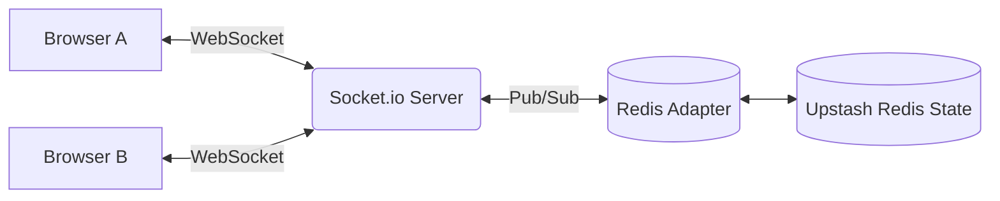

<div align="center">
  <h1>Scribophobia</h1>
  <p><b>Conquer the blank canvas.</b> A real-time, collaborative infinite whiteboard for sketching, diagramming, and system design.</p>
  
  <p>
    <a href="https://scribophobia.vercel.app/" target="_blank">
      
    </a>
  </p>

  <p>
    
    
    
    
    
  </p>
</div>

---

## Overview

**Scribophobia** is a full-stack collaborative whiteboard built for teams. Multiple users can draw, annotate, and design system architectures together in real time — all changes sync instantly across every connected session with near-zero latency.

---

## Features

### 🖌️ Drawing Tools
- **Pen** — smooth freehand drawing with a cursive stroke feel
- **Marker** — bold, thick strokes for emphasis
- **Smart Pen** — intelligent drawing mode
- **Lasso** — freehand selection of canvas objects
- **Eraser & Pixel Eraser** — precise, whiteboard-style erasure

### Shapes & Primitives
- **Connectors:** Line, Arrow, Elbow Arrow, Block Arrow
- **Primitives:** Rectangle, Oval, Rhombus, Triangle, Divider
- *All shapes are draggable, resizable, and synchronized in real time.*

### Text & Notes
- **Text Tool** — click to place editable inline text
- **Sticky Notes** — draggable annotation cards with multiple color options

### Infinite Canvas & Navigation
- **Infinite canvas** — pan with `Alt+Click` or middle mouse button
- **Minimap** — interactive mini-map for quick navigation across large boards
- **Zoom** — pinch/scroll to zoom (10% to 500%), with percentage display

### Real-Time Collaboration
- **WebSockets** — low-latency, real-time multi-user sync powered by Socket.io
- **Redis Persistence** — instant full board sync for newly joined users
- **Share Modal** — instantly copy an invite link to bring your team in

---

## Tech Stack

| Layer | Technology |
|---|---|
| **Frontend** | React 18 + Vite, TypeScript |
| **Canvas Engine** | Fabric.js v7 |
| **State Management**| Zustand |
| **Real-time** | Socket.io (client + server) |
| **Backend** | Node.js + Express |
| **WebSocket Adapter**| `@socket.io/redis-adapter` |
| **Persistence** | Redis (hot state via hashes) |

---

## Getting Started Locally

### Prerequisites
- Node.js 18+
- Redis (Local or Upstash Cloud)

### 1. Start the Backend
```bash
cd backend
npm install
npm run dev
```
*Server runs on `http://localhost:3001`.*

### 2. Start the Frontend
```bash
cd frontend
npm install
npm run dev
```
*App runs on `http://localhost:5173`.*

---

## Deployment

Scribophobia is optimized for easy deployment to modern cloud platforms:

- **Frontend:** Hosted on [Vercel](https://vercel.com/) (Zero-config via `vercel.json`).
- **Backend:** Hosted on [Render](https://render.com/) (Auto-deployed via `render.yaml`).
- **Database:** Uses [Upstash Redis](https://upstash.com/) for serverless, low-latency state persistence.

---

## 📡 Architecture



- **Hot State**: Every canvas object is stored in a Redis hash (`board:<id>:objects`) keyed by object ID. New clients receive a full sync immediately on connection.
- **Pub/Sub Adapter**: The Socket.io Redis Adapter enables horizontal scaling across multiple server instances.
